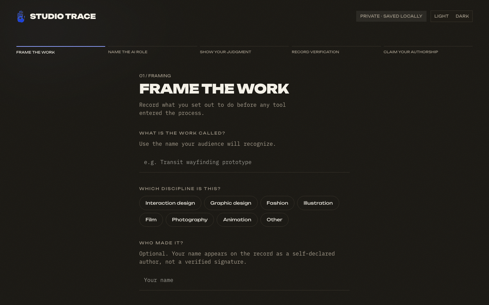

# Studio Trace

[**Try Studio Trace**](https://studio-trace.netlify.app/)




A disclosure checkbox proves nothing about judgment. Studio Trace is a one-page tool that walks a creator through five prompts—intent, the role AI played, what they accepted or rejected, what they verified, and which decisions stayed theirs—and assembles the answers into a creative process record they can copy or download as Markdown. It documents judgment, not just the tool.

## What it is not

The export is a self-report. Studio Trace does not verify identity, sources, or authorship claims, and it says so on every export. It is a structured way to reflect and disclose, not a credential or proof.

## Product decisions

- **Human-authored by design.** An early concept allowed an AI agent to populate the record. That contradicted the product's purpose, so it was replaced with a read-only interview tool. Claude can ask questions that help a creator remember and articulate decisions, but it cannot read the draft or write answers.
- **Local-first privacy.** Drafts remain in the creator's browser through `localStorage`; there is no account, upload, or backend.
- **Citable context with clear limits.** Every export identifies its limits and includes optional creator, work, version, and export-date context without presenting the record as verified proof.

## How it works

- Five short prompts, each with a one-line example. The assembled record appears at the final step, ready to copy or download.
- Everything is saved to `localStorage` in your own browser. Nothing is uploaded, and there is no backend.
- A read-only interview tool can hand back one of the five prompt questions to a host that supports it (for example, asking Claude to interview you about your process). It can only ask questions; it cannot read or write your answers.

## Three surfaces

| Path | What it is |
| --- | --- |
| `/` | The landing: a one-point perspective corridor built from type. Pressing either call to action flies the camera down it and into the flow; coming back reverses the move. |
| `/start` | The five step flow, and the finished record. |
| `/why` | The case for distinguishing the tool from the author. It layers over the landing rather than replacing it, so the URL stays linkable while the corridor blurs behind it. |

There is no router: `src/main.tsx` switches on `location.pathname`, and `public/_redirects` tells Netlify to serve `index.html` for every path so a direct load or refresh resolves.

## Why this matters for AI-enabled design

Studio Trace explores a product-design question: how might an interface encourage useful AI collaboration without allowing automation to erase the creator's judgment? The answer is not another disclosure checkbox. It is a structured account of what the creator intended, accepted, rejected, checked, and ultimately decided.

The project is also designed to support critique circles and student conversations about responsible AI collaboration. A participant can document one Claude-assisted project, compare decisions with peers, and discuss what meaningful human oversight looks like without exposing confidential work.

## Development

```bash
npm install
npm run dev      # local dev server
npm run build    # typecheck + production build
npm test         # unit tests for the export and interview logic
npm run lint      # oxlint
```

Built with React 19, Vite, and Tailwind CSS. UI primitives are stock [shadcn](https://ui.shadcn.com) components on [Base UI](https://base-ui.com).

## Type

Two families, split by who is speaking. **Unbounded** is the product's voice: display sizes, and the small uppercase labels, step counters and buttons. **IBM Plex Mono** is everything read or written — the questions, the creator's own answers, and the finished record. Both load from Google Fonts.

Colour carries one rule throughout: cobalt marks what you do next, acid green marks what is settled. Acid never appears on an interactive control. Because a thin acid line measures 1.23:1 on the light canvas, strokes (the focus ring, completed rail segments, the record's left rule) use a darkened green in light mode and pure acid in dark.

## Pointer trail

The landing uses [React Bits PixelTrail](https://reactbits.dev/animations/pixel-trail) with grid size 83, trail size 0.06, maximum age 200 ms, interpolation 3, colour from the `--trail` token, and gooey filter strength 2. It sits behind the content and listens to pointer movement without intercepting clicks. The effect loads separately, is disabled for reduced motion and touch-only devices, and unmounts in hidden tabs. If WebGL is unavailable the page still works. It is deliberately kept off the five step flow, where it would compete with the caret. Component attribution and license are in [REACT-BITS-LICENSE.md](REACT-BITS-LICENSE.md).
