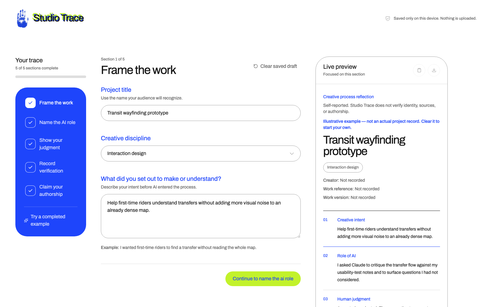

# Studio Trace



A disclosure checkbox proves nothing about judgment. Studio Trace is a one-page tool that walks a creator through five prompts, intent, the role AI played, what they accepted or rejected, what they verified, and which decisions stayed theirs, and assembles the answers into a "creative process reflection" they can copy or download as Markdown. It documents judgment, not the tool.

## What it is not

The export is a self-report. Studio Trace does not verify identity, sources, or authorship claims, and it says so on every export. It is a structured way to reflect and disclose, not a credential or proof.

## How it works

- Five short prompts, each with a one-line example and a live preview that assembles as you go.
- Everything is saved to `localStorage` in your own browser. Nothing is uploaded, and there is no backend.
- A read-only interview tool can hand back one of the five prompt questions to a host that supports it (for example, asking Claude to interview you about your process). It can only ask questions; it cannot read or write your answers.

## Development

```bash
npm install
npm run dev      # local dev server
npm run build    # typecheck + production build
npm test         # unit tests for the export and interview logic
npm run lint      # oxlint
```

Built with React 19, Vite, and Tailwind CSS. UI primitives are stock [shadcn](https://ui.shadcn.com) components on [Base UI](https://base-ui.com).

## Status

Independent project by Sylvia Zamora, built for the Claude Campus Ambassador program. Not affiliated with or endorsed by Anthropic.
